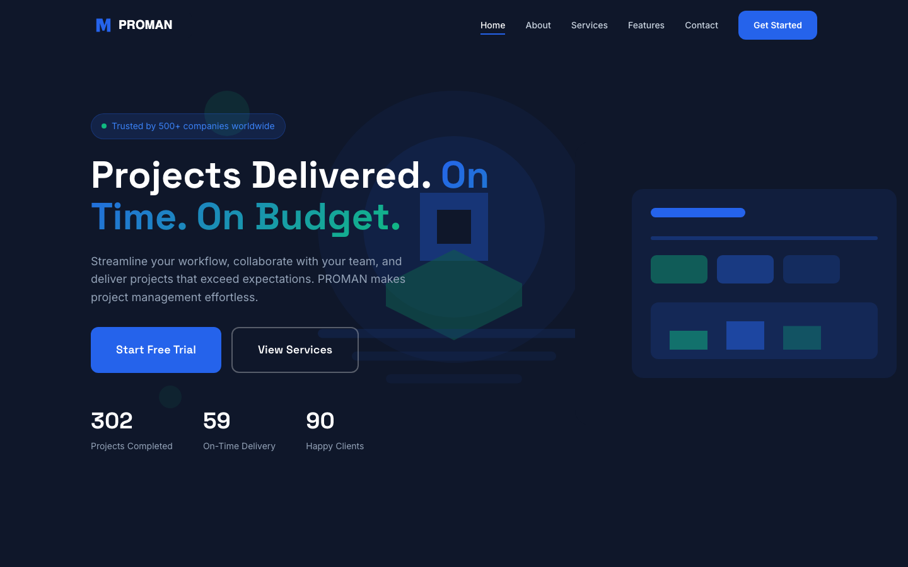

# PROMAN — Project Management HTML Template

A premium, framework-free HTML template for project management software, SaaS products, and professional service teams. PROMAN combines a confident blue-and-navy palette with a clean, modern layout that sells planning, execution, and on-time delivery.

## 📸 Screenshot

## 🎨 Design System

| Token | Value | Usage |
|-------|-------|-------|
| `--blue` | `#2563EB` | Primary accent, CTAs, highlights |
| `--blue-dark` | `#1D4ED8` | Hover states |
| `--navy` | `#0F172A` | Backgrounds, headings, footer |
| `--green` | `#10B981` | Success accents, stats |
| `--gray-400` | `#94A3B8` | Body text |
| Headings | Space Grotesk (500/600/700) | Modern display type |
| Body | Inter (400–700) | Clean geometric sans |

## 📄 Pages

| Page | Description | Sections |
|------|-------------|----------|
| [index.html](index.html) | Home | Hero, end-to-end PM overview, feature grid, testimonial slider, CTA |
| [about.html](about.html) | Company story | Empowering teams, values, journey timeline, team, community |
| [features.html](features.html) | Product capabilities | Additional feature grid, video-style showcase |
| [services.html](services.html) | Offerings | Strategic planning, execution, on-time delivery, transparent pricing, custom solutions |
| [contact.html](contact.html) | Contact | Form (name, email, subject, message), FAQ accordion |

## ⚙️ Tech Stack

- **HTML5** — semantic markup, accessibility-first
- **CSS3** — custom properties, Grid, Flexbox, `clamp()`
- **Vanilla JS** — IntersectionObserver reveals, animated counters, mobile nav, contact-form validation, FAQ toggles
- **Fonts** — Google Fonts (Space Grotesk + Inter)
- No frameworks, no build step, no dependencies

## 📁 Images

All imagery lives in `assets/img/` — 36 files including feature icons (tracking, collaboration, analytics, reporting), project screenshots (6), team portraits, testimonials, and SVG illustrations.

---

**Template by uiuxlabz** — framework-free, responsive, production-ready.

### Let's Build Something Together 🚀

[https://tally.so/r/q4q1L9](https://tally.so/r/q4q1L9)
